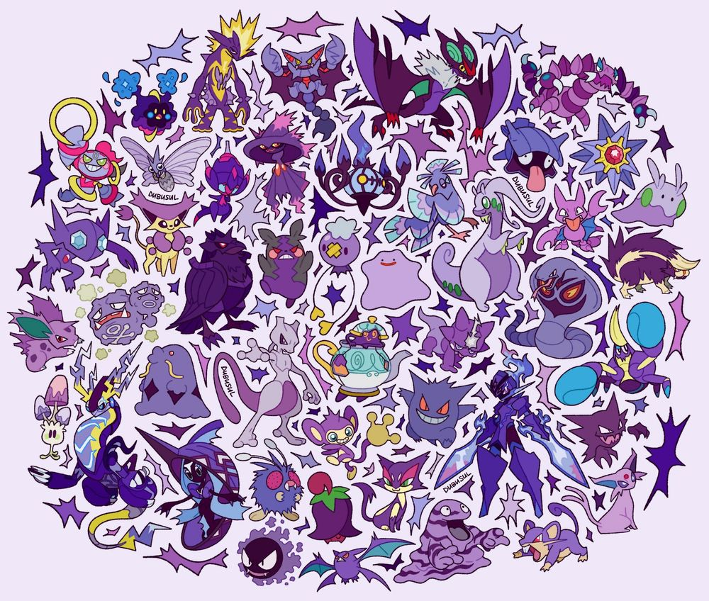
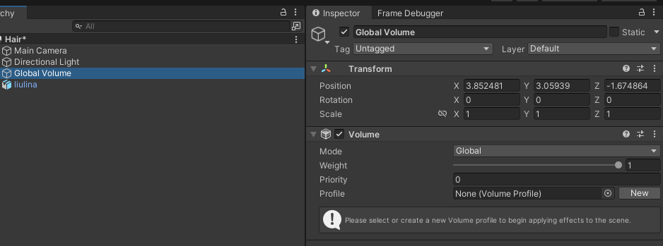
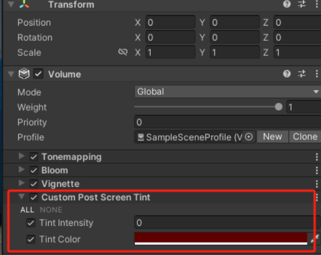
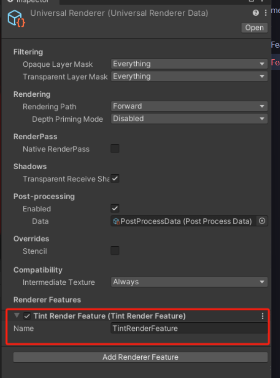

# URP后处理


## 简介
本文介绍URP如何使用后处理。因为URP管线的后处理与built-in管线的后处理有一些区别，而且URP的使用要稍微复杂一些，所以作为一个教程详细介绍

## 后处理结构
- Volume Component - Unity新增的组件，用于控制效果参数
- Render Feature - 负责将后处理效果注入渲染管线
- Render Pass - 实现具体的渲染逻辑
- Shader - 定义后处理的具体视觉效果

## Volume Component

这是volume组件的图片，可以定义为全局与局部，由于后处理的效果是全局的，所以我们这里定义为全局。

volume组件有【Add Override】按钮，用于添加组件。以下是组件代码编写，继承VolumeComponent，实现IPostProcessComponent接口。可以定义组件的参数。
```csharp
using System;
using UnityEngine;
using UnityEngine.Rendering;
using UnityEngine.Rendering.Universal;

[Serializable, VolumeComponentMenu("CustomPostScreenTint")]
public class CustomPostScreenTint : VolumeComponent, IPostProcessComponent
{
    public bool IsActive() => true;

    public bool IsTileCompatible() => true;

    [Tooltip("Intensity of the tint effect")]
    public FloatParameter tintIntensity = new FloatParameter(0.5f);
    [Tooltip("Color to tint the screen with")]
    public ColorParameter tintColor = new ColorParameter(Color.white);

}
```
效果如下




## Render Feature & Render Pass
创建c#脚本，完成两个类的代码编写。第一个是Render Feature，继承ScriptableRendererFeature，实现AddRenderPasses方法。第二个方法是Render Pass，继承ScriptableRenderPass，实现OnCameraSetup，Execute，OnCameraCleanup方法。

第一个类是连接URP Render Feature的入口，也可以自定义参数，在Render Feature管理界面中会展示对应参数。
第二个类是具体的渲染逻辑，负责初始化，每帧执行渲染逻辑，每帧结束后清理资源。

以下是示例代码，完成简单的颜色叠加
```csharp
using UnityEngine;
using UnityEngine.Rendering;
using UnityEngine.Rendering.Universal;

public class TintRenderFeature : ScriptableRendererFeature
{

    private TintPass tintPass;

    public override void Create()
    {
        tintPass = new TintPass();
    }
    public override void AddRenderPasses(ScriptableRenderer renderer, ref RenderingData renderingData)
    {
        renderer.EnqueuePass(tintPass);
    }

    class TintPass : ScriptableRenderPass
    {
        private Material tintMaterial;
        int tintShaderID = Shader.PropertyToID("_Temp");
        RenderTargetIdentifier src, tint;
        public TintPass()
        {
            if (!tintMaterial)
            {
                var shader = Shader.Find("CustomPost/URPScreenTintShader");
                if (shader == null)
                {
                    Debug.LogWarning("Cannot find shader: CustomPost/URPScreenTintShader");
                    return;
                }
                tintMaterial = new Material(shader);
            }
            renderPassEvent = RenderPassEvent.BeforeRenderingPostProcessing;
        }

        public override void OnCameraSetup(CommandBuffer cmd, ref RenderingData renderingData)
        {

            src = renderingData.cameraData.renderer.cameraColorTarget;
            var descriptor = renderingData.cameraData.cameraTargetDescriptor;
            cmd.GetTemporaryRT(tintShaderID, descriptor);
            tint = new RenderTargetIdentifier(tintShaderID);
        }

        public override void Execute(ScriptableRenderContext context, ref RenderingData renderingData)
        {
            CommandBuffer cmd = CommandBufferPool.Get("TintRenderFeature");
            VolumeStack stack = VolumeManager.instance.stack;
            CustomPostScreenTint tintComponent = stack.GetComponent<CustomPostScreenTint>();
            if (tintComponent == null || !tintComponent.IsActive())
            {
                Debug.LogWarning("CustomPostScreenTint is missing or inactive.");
                return;
            }


            tintMaterial.SetColor("_OverlayColor", tintComponent.tintColor.value);
            tintMaterial.SetFloat("_Intensity", tintComponent.tintIntensity.value);

            Blit(cmd, src, tint, tintMaterial);
            Blit(cmd, tint, src);

            context.ExecuteCommandBuffer(cmd);
            CommandBufferPool.Release(cmd);

        }
        public override void OnCameraCleanup(CommandBuffer cmd)
        {
            cmd.ReleaseTemporaryRT(tintShaderID);
        }
    }
}
```

在URP Renderer Asset中添加Render Feature，即可完成注入。



## Shader
后处理效果的核心，常见的后处理效果，如高斯模糊，颜色叠加，景深等，都可以通过Shader实现。在URP中，需要理解的是，Render Pass实现的是渲染流程，而Shader是具体的渲染效果。

## 参考资料
- UnityURP 自定义PostProcess https://blog.csdn.net/a71468293a/article/details/144649558
- Unity URP中的Post-processing https://blog.csdn.net/qq_17347313/article/details/106846631
