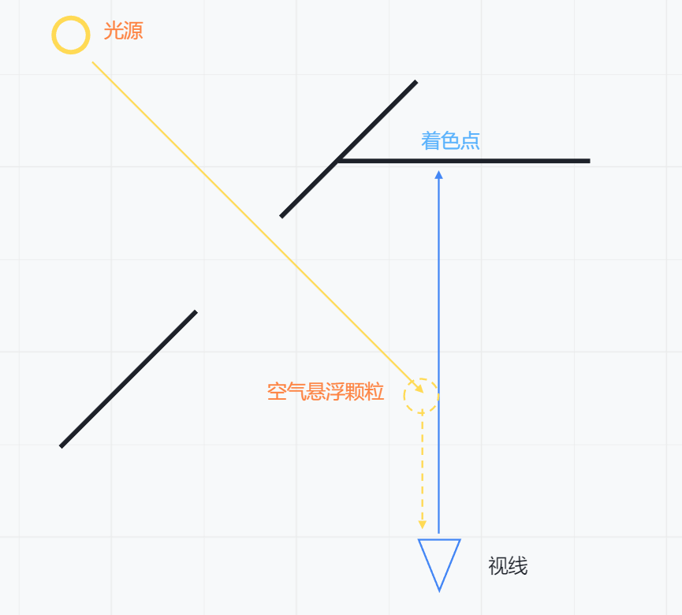
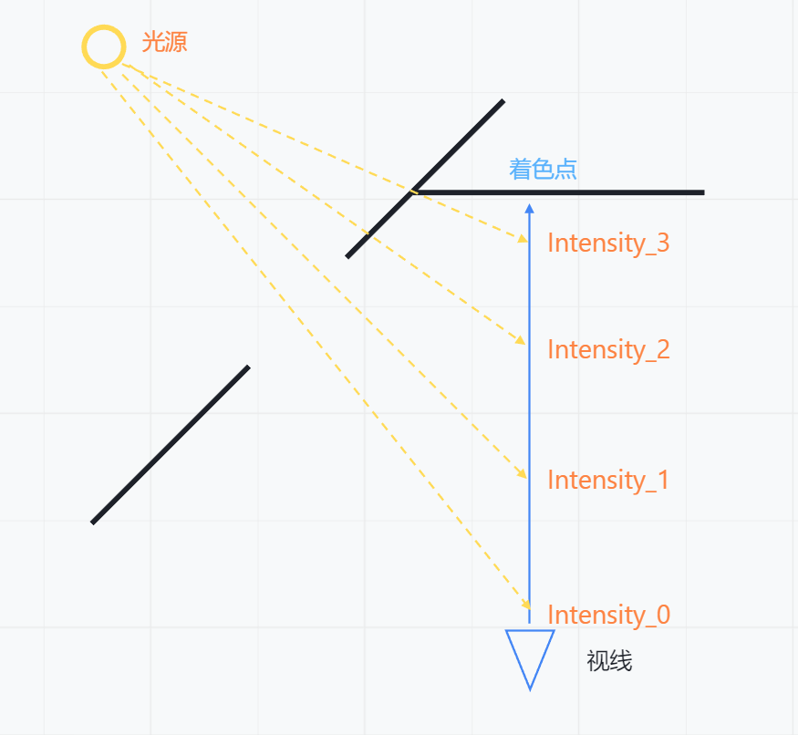
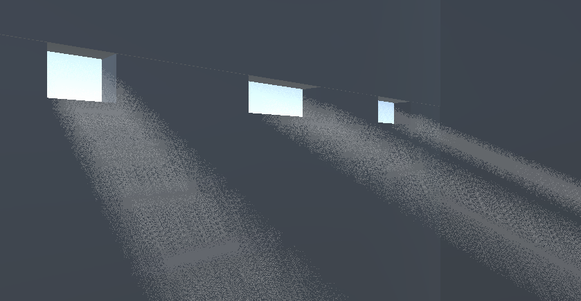
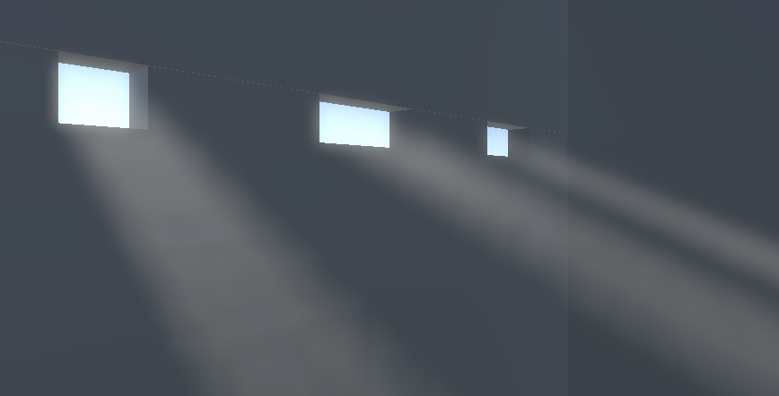

# 体积光
## 简介
体积光是模拟现实中散射效果，散射的光线进入人眼，让这些介质看起来像拢住了光线一样，也就是所谓的体积光。


## 物理原理
如图所示，我们的摄像机的视线，本来应该是打在墙面上进行着色。但是由于左侧环境有“缺口”，光源的光路与视线存在交点。此时我们认为空气中有悬浮颗粒，能造成光线的散射，那么意味着有一部分光线会沿着与我们视线平行的方向进入摄像机，那么就会导致原本的着色点更“亮”。

这种造成“着色点更亮”的结果，就是我们视觉上认为的“体积光”。

而“光线步进”实际上就是在我们的视线方向上不断采样，看看采样点是否受光，统计起来就是这一点的总计“光强”。


## 实现
### 重建世界坐标
由于我们是基于后处理的方式实现的，所以我们需要重建世界坐标。从屏幕空间到世界空间的转换，使用Unity的内置函数**ComputeWorldSpacePosition**，具体可以参考官方文档：https://docs.unity3d.com/Packages/com.unity.render-pipelines.universal@12.1/manual/writing-shaders-urp-reconstruct-world-position.html

### 光线步进
计算光线步进的方式有很多，这里我们使用最简单的方式，就是沿着视线方向，不断采样。
每个采样点的光强，可以使用光线的衰减值参与计算，使用的也是Unity的内置函数：从ShadowMap取样，值越小，说明光线越弱。
```csharp
// 获取光照衰减
float GetLightAttenuation(float3 position)
{
    float4 shadowPos = TransformWorldToShadowCoord(position);
    float atten = MainLightRealtimeShadow(shadowPos);
    return atten;
}        
```

光线的效果依赖于步进的距离和计算的次数，当步进距离均等时，次数减少，锯齿感会更明显。所以为了达到更好的效果，抖动每次的步进距离，使用随机数实现。

这是计算次数为8的效果图，但是噪点很多，所以需要使用到模糊方法。

### 双边滤波
双边滤波是一种非线性的滤波方法，它可以保留图像的边缘信息，同时也可以平滑图像的噪声。很适合处理上图的噪点。
双边滤波的原理是，对于每个像素，它的滤波结果是由它周围的像素加权平均得到的。但是，它还考虑了像素之间的相似度，也就是说，距离较近的像素权重较高，距离较远的像素权重较低。这样，就可以保留图像的边缘信息，同时也可以平滑图像的噪声。

## 最终效果


## 参考资料
- URP | 后处理 - 体积光 Volumetric Lighting https://www.bilibili.com/read/cv27062642
- 四种体积光的写法 https://zhuanlan.zhihu.com/p/654176019
- 【UnityShader】Volumetric Light 体积光（8）https://zhuanlan.zhihu.com/p/573203289
